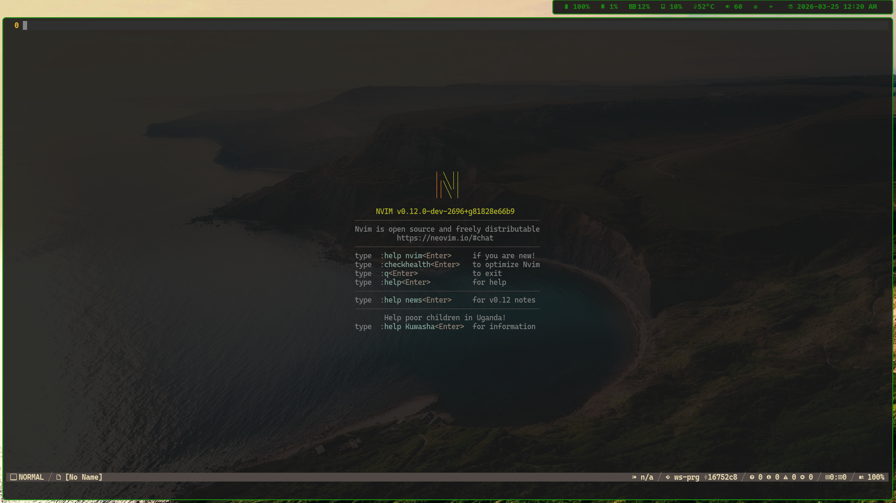

# Nvim, Personal Config

__*NOTE:*__
- Using vim.pack
- No package manager
- Meant to use for 0.12.* or above

 

- Check [this file](./lua/globals/prt.lua#L225) for lsp/s
- Check [this file](./lua/globals/prt.lua#L251) for treesitters

 

## Installed Plugins

- [fzf-lua](./lua/plugins/fzf-lua.lua)
- [gitsigns](./lua/plugins/gitsigns.lua)
- [hlchunk](./lua/plugins/hlchunk.lua)
- [netrw-nvim](./lua/plugins/netrw.lua)
- [smear-cursor](./lua/plugins/smear-cursor.lua)
- [typst-preview](./lua/plugins/typst-preview.lua)
- [markdown-render](./lua/plugins/markdown-render.lua)
- [markdown-preview](./lua/plugins/markdown-preview.lua)
- [nvim-lspconfig](./lua/plugins/nvim-lspconfig.lua)
- [nvim-treesitter](./lua/plugins/nvim-treesitter.lua)
- [nvim-web-devicons](./lua/plugins/nvim-web-devicons.lua)

See `./lua/plugins` directory for more details.

 

## [internal plugins](./lua/prt/README.md)

- [cmdp](./lua/prt/cmdp.lua)
- [dmmr](./lua/prt/dmmr.lua)
- [xplrr](./lua/prt/xplrr.lua)
- [snppts](./lua/prt/snppts.lua)
- [cmpltn](./lua/prt/cmpltn.lua)

 

## Configured/Default Keymap/Shortcut

Read [this file](./lua/settings/keymaps.lua) for more information

 

---

###### end of readme

